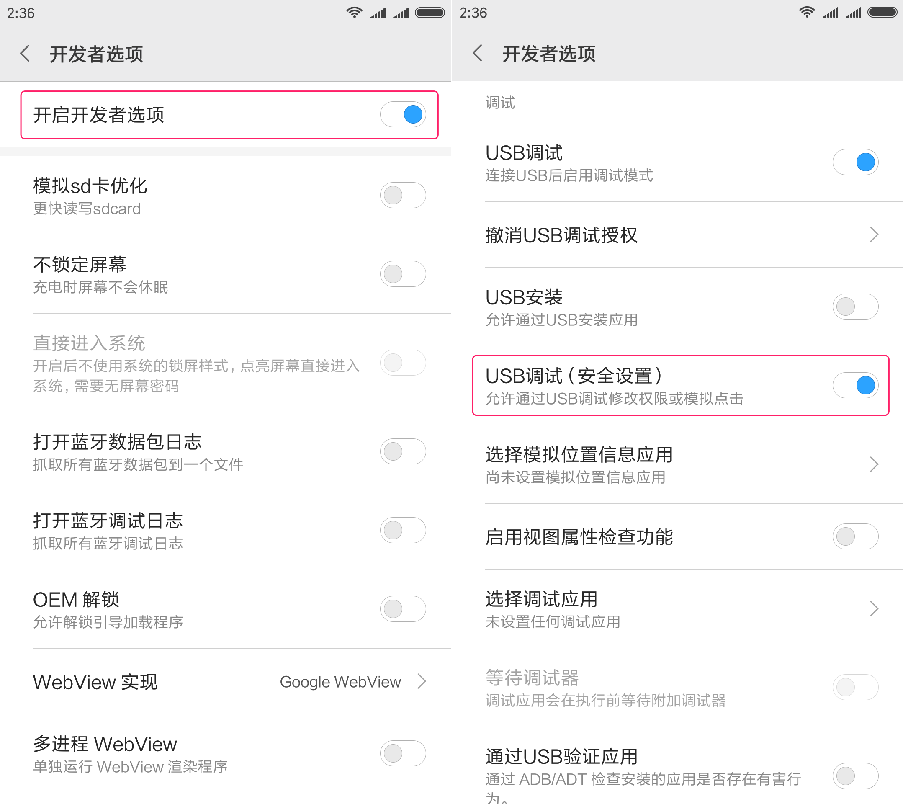

# 使用Kotlin玩儿微信跳一跳

### 后知后觉

元旦前后微信发布了小游戏跳一跳，一时间红遍大江南北，坐着跳、站着跳、走着跳，坐车跳、上厕所跳、开外挂跳...

鄙人对游戏并不感冒，直到有一天身边所有人都在跳，于是乎...

PS: 其实也有种“为什么风头都被python抢去了”的不爽，于是我用了kotlin... 接下来，300行kotlin带你玩儿转跳一跳！

### 使用说明

1. 电脑安装[ADB](https://android.gadgethacks.com/how-to/android-basics-install-adb-fastboot-mac-linux-windows-0164225/)工具
2. 手机开启“开发者选项”，并打开“USB调试”

3. 打开跳一跳，并开始游戏
4. Release中下载zip包并解压，运行 `./wechat-jump-1.0.0.jar`

> 不要太贪心哦~

### 实现思路

1. 使用ADB获取游戏截图
2. 利用棋子的颜色识别棋子，利用底色和棋盘的色差识别棋盘
3. 计算棋子和棋盘的距离，以此获得按压时间
4. 使用ADB工具按压屏幕，蓄力一跳

### CHANGELOG

- 2018-01-14
  - 使用kotlin，自动运行微信跳一跳
